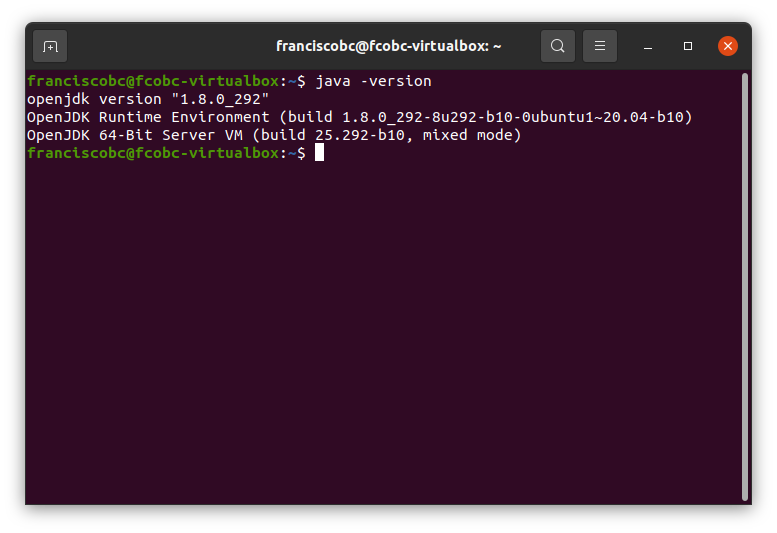
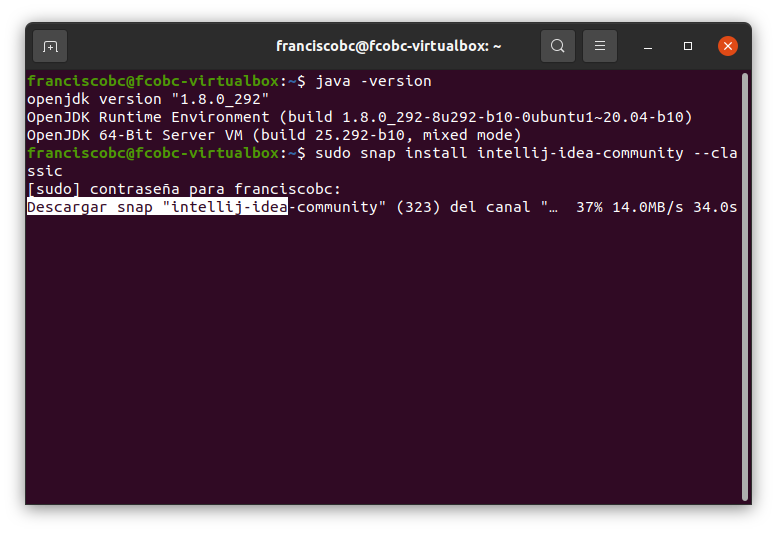

# Instalación del IDE IntelliJ IDEA

## Paso 1. Comprobar versión de Java.
Para verificarlo se ejecuta por línea de comando:
java -version

## Paso 2. Instalación del IDE IntelliJ IDEA.
Se instala la edición Community, por comando:
sudo snap install intellij-idea-community –classic

Se instala correctamente sin mostrar errores.

## Paso 3. Comprobar el funcionamiento.
Se inicia desde actividades, que responde a su ejecución y responde sin errores.

Queda instalado el IDE IntelliJ IDEA.
