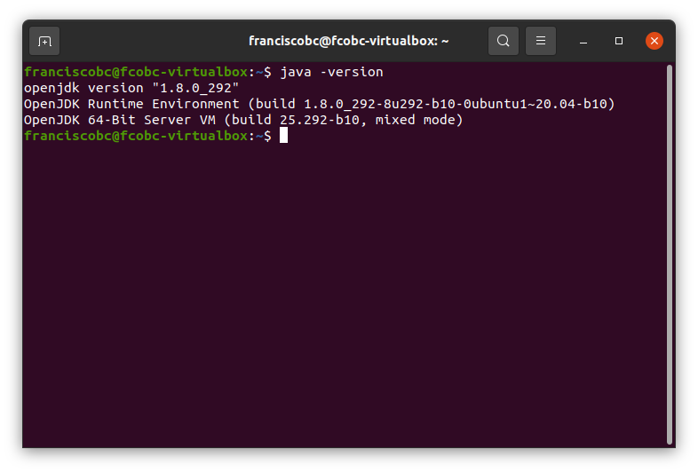
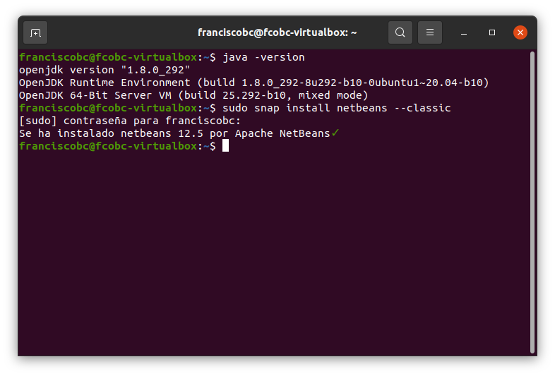
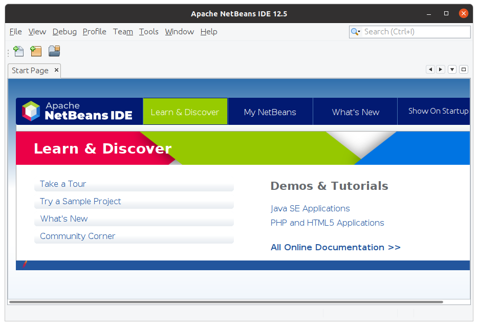

# Instalación de Netbeans 12

## Paso 1. Comprobando la versión de java instalada.
Se utiliza con el comando: 

java -version

## Paso 2. Instalación del Ide Netbeans 12
Se ejecuta el comando:

sudo snap install netbeans –classic

La instalación finalizó con esta pantalla:

## Paso 3. Ejecución del ide
Ya está instalado en el sistema dentro de la máquina virtual, lo localizamos en la relación de programas y lo ejecutamos para comprobar que funciona.

