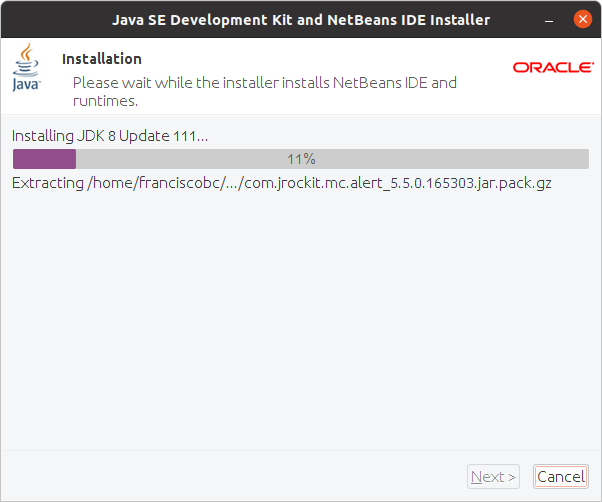

# Instalación del IDE Netbeans 8.
## Paso 1. Comprobar la versión de Java instalada
Para verificarlo se ejecuta el comando:

java -version

Aunque se ha revisado varias veces, pero lo sigo comprobando antes de cada instalación.

## Paso2. Descargando la versión 8.2.
La instalación se va a realizar por línea de comandos, pero hay que descargar primero la versión correcta desde el enlace de Oracle.
Se descarga la versión jdk-8u111-nb-8_2-linux-x64.sh

## Paso 3. Instalación del IDE Netbeans 8
Ya lo tengo descargado en la carpeta local de la maquina virtual, y procedo a la instalación con el siguiente comando:

/home/franciscobc/Descargas/jdk-8u111-nb-8_2-linux-x64.sh

## Paso 4. Se comienza a instalar.
Se auto ejecuta el instalador. Acepto las condiciones y continua la instalación dándole a siguiente.

## Paso 5. Comprobación de ejecución.
Ya terminada la instalación, reinicie todo el sistema y la máquina virtual. Luego busque en la aplicación para comprobar que funciona correcta.

Queda instalado el IDE Netbeans 8, en el sistema Linux dentro de la máquina virtual.
