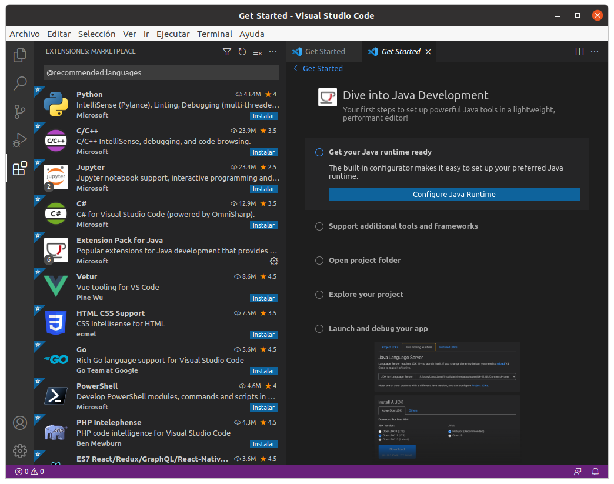
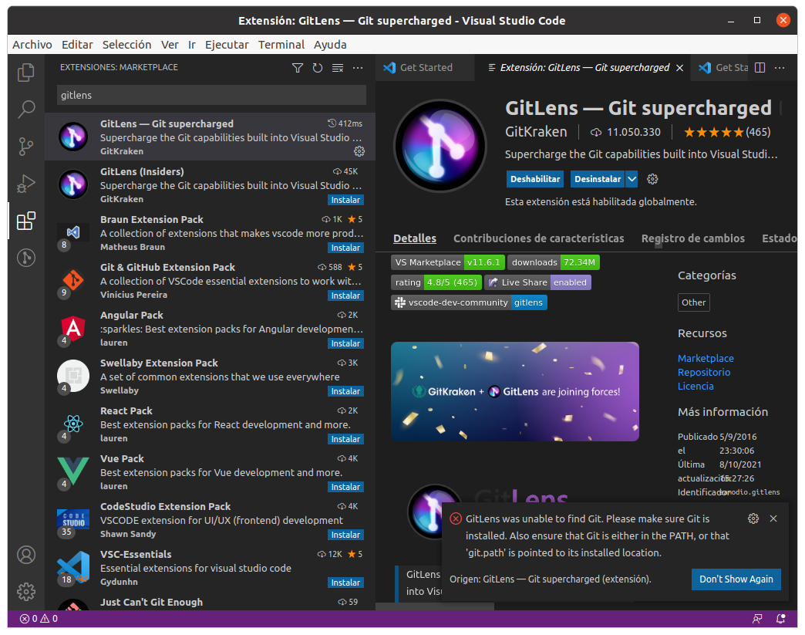

# Instalación del IDE VS-Code

## Paso 1. Comprobar versión de Java.
Se emplea desde terminal el comando:
java -version

## Paso 2. Instalación del IDE VS-Code
Comienza la instalación con líneas de comando:
sudo snap install --classic code

## Paso 3. Ya instalado el IDE, se instalan complementos.
Instalando extensiones desde el propio VS-Code.
•	Java Extension Pack
•	GitLens
•	Visual Studio IntelliCode
•	Path intellisense
•	Bracket Pair Colorizer
•	Prettier Code formatter
•	Color Hightight
•	Indent Rainblow

### Extensión: Java Extension Pack
Este pack contiene las extensiones que juntas nos brindan todas las herramientas que necesitamos para realizar trabajos en Java. 

### Extensión: GitLens
Para poder ver quién cambió la línea de código en la que estoy y cuándo, ver el historial de cambios de cada archivo, diferenciar entre cambios, etc. 

### Extensión: Visual Studio IntelliCode
Ahorra tiempo al poner lo que es más probable que use en la parte superior de la lista de finalización. Las recomendaciones de IntelliCode se basan en miles de proyectos de código abierto en GitHub.

### Extensión: Path intellisense
Ayuda a encontrar la ruta de un fichero en el proceso de desarrollo de una aplicación de una manera muy rápida y dinámica.

### Extensión: Bracket Pair Colorizer
Colorea los corchetes, llaves y paréntesis de inicio y fin de un bloque de código. Lo cual facilita muchísimo la lectura del código.

### Extensión: Prettier Code formatter
Se utiliza para formatear automáticamente tu código, soportando la sintaxis de una gran cantidad de lenguajes.

### Extensión: Color Hightight
Ayuda a poder visualizar tanto en el mini mapa como en el código en sí dichos colores ya renderizados. Podemos personalizar si los queremos ver como fondo, como línea debajo del texto, o hacer que el código del color en sí sea del color.

### Extensión: Indent Rainblow
Para colorear la sangría frente a su texto alternando cuatro colores.

Queda instalado el IDE VS-Code y algunas extensiones para facilitar los trabajos.
